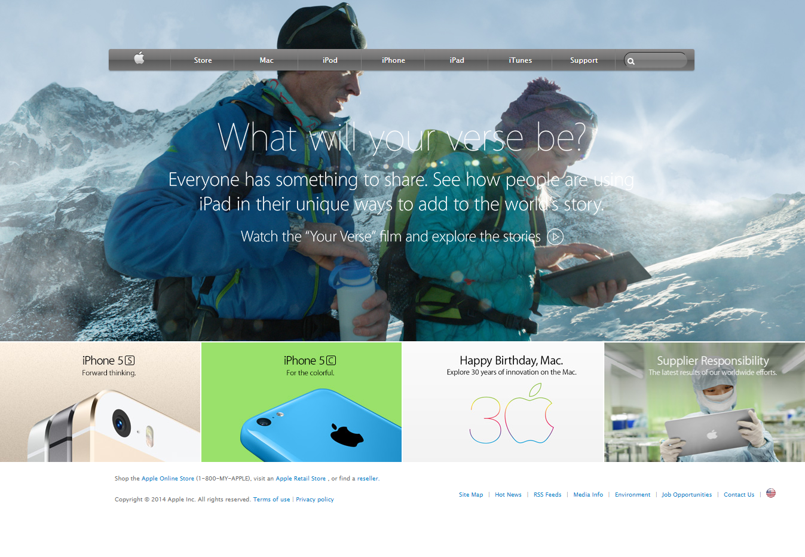

<h3 align="center">Apple Clone Web Site Project</h3>

<div align="center">

[](https://github.com/fdfragoso/apple-site-clone/issues)
[](https://github.com/fdfragoso/apple-site-clone/pulls)
[](https://github.com/fdfragoso)
[](/LICENSE)

</div>

---

## 📝 Content
<p align="center">
<a href="#about">About</a>&nbsp;&nbsp;&nbsp;|&nbsp;&nbsp;&nbsp;
<a href="#install">Install</a>&nbsp;&nbsp;&nbsp;|&nbsp;&nbsp;&nbsp;
<a href="#built_using">Build with</a>&nbsp;&nbsp;&nbsp;|&nbsp;&nbsp;&nbsp;
<a href="#authors">Developer</a>
</p>


## 🧐 About <a name = "about"></a>
<h3 align="center"> This is an assigment for Microverse's HTML and CSS course, and the goal is to clone an <a href="http://archive.md/UW4oR">old Apple web site</a>, to learn about CSS Backgrounds and Gradients.</h3>
<p align="center">
  <a href="" rel="noopener">
 </a>
</p>

---

## 🔧 Built with<a name = "built_using"></a>

- [HTML and CSS](https://www.w3schools.com/) - HTML5 and CSS3
- [Stickler](https://stickler-ci.com) - A CSS Linter 
- [W3 HTML Validator](https://validator.w3.org/) - A Markup Validation Service

## 🔴 Live Demo

[Live Demo](https://raw.githack.com/fdfragoso/apple-site-clone/features/index.html)

### 🛠 Install <a name = "install"></a>

```
- Clone or download this repository;
- Unpack (if downloaded);
- Execute index.html on your favorite browser;

OR

- Click on the live demo link above this session.

```
## ✒️ Developer <a name = "authors"></a>

👤 **Felipe Fragoso**

- Github: [@fdfragoso](https://github.com/fdfragoso)
- Twitter: [@fdfragoso](https://twitter.com/fdfragoso)
- Linkedin: [@fdfragoso](https://www.linkedin.com/in/fdfragoso/)

## 🤝 Contributing

Contributions, issues and feature requests are welcome!

Feel free to check the [issues page](https://github.com/fdfragoso/apple-site-clone/issues).

## 👍 Show your support

Give a ⭐️ if you like this project!

## 👊 Acknowledgments

- The Odin Project
- Microverse
- Apple

## 📝 License

This project is free to use as learning purposes. 
For any external content (e.g. logo, images, ...), please contact the proper author and check their license of use. 
This is a studying project and not commercial.